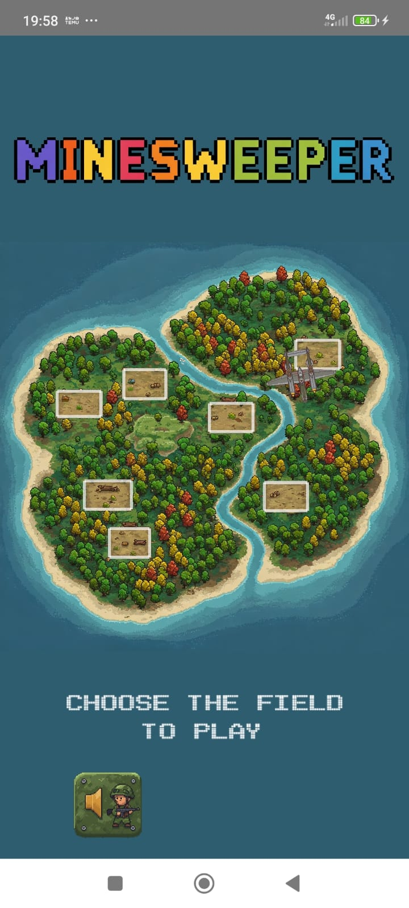

# minesweeper
This game was developed for the RAD Programmer Challenge #1

Bem-vindo ao Minesweeper: Operação Ilha Perdida!

Este repositório contém o código-fonte de Minesweeper: Operação Ilha Perdida, um jogo desenvolvido em Pascal para uma competição de programação. Inspirado no clássico Campo Minado, este projeto traz uma temática militar envolvente, ambientada em uma ilha misteriosa com 8 campos de jogo distintos. Você é um especialista em localização de minas encarregado de limpar terrenos perigosos.

Este é um projeto de código aberto, criado com paixão para demonstrar habilidades de programação e criatividade. Sinta-se à vontade para explorar o código, jogar, contribuir ou adaptá-lo para seus próprios projetos. Abaixo, você encontrará mais detalhes sobre como o jogo funciona, como executá-lo e algumas notas sobre o desenvolvimento. Divirta-se e boa sorte na sua missão!

Sobre o Desenvolvimento e Limitações

Devido à minha carga de trabalho, Minesweeper: Operação Ilha Perdida foi desenvolvido inteiramente nas minhas horas vagas, o que impactou o tempo disponível para implementar todas as ideias que eu tinha em mente. Recursos como um modo treinamento, para ajudar novos jogadores a aprenderem as mecânicas, e um modo história, que traria uma narrativa mais profunda à temática da ilha, acabaram ficando de fora desta versão. Apesar disso, o jogo está funcional e cumpre o objetivo da competição, e espero poder adicionar essas funcionalidades no futuro!

Welcome to Minesweeper: Lost Island Operation!

This repository contains the source code for Minesweeper: Lost Island Operation, a game developed in Pascal for a programming competition. Inspired by the classic Minesweeper, this project features an immersive military theme, set on a mysterious island with 8 distinct playable fields. You are a mine-detection expert tasked with clearing hazardous terrains.

This is an open-source project, built with passion to showcase programming skills and creativity. Feel free to explore the code, play the game, contribute, or adapt it for your own projects. Below, you’ll find more details on how the game works, how to run it, and some notes on its development. Have fun and good luck on your mission!

About Development and Limitations

Due to my busy workload, Minesweeper: Lost Island Operation was entirely developed during my spare time, which limited the time available to implement all the ideas I had in mind. Features like a training mode, to help new players learn the mechanics, and a story mode, which would add a deeper narrative to the island’s theme, couldn’t be included in this version. Nevertheless, the game is fully functional and meets the competition’s goals, and I hope to add these features in the future!

Nota sobre a Indentação do Código

Olá! Se você está analisando o código-fonte do Minesweeper: Operação Ilha Perdida no GitHub, talvez tenha notado que a indentação segue um estilo um pouco diferente do padrão moderno usado no Delphi. Há uma razão para isso: eu programo em Pascal desde 1986, uma época em que desenvolvíamos em micros domésticos de 8 bits com telas pequenas e limitações técnicas. Para facilitar a leitura e o desenvolvimento naquele contexto, adotei uma indentação própria que se tornou parte do meu fluxo de trabalho ao longo de quase quatro décadas.
Entendo que esse estilo pode não agradar a todos, especialmente se você está acostumado com as convenções atuais do Delphi. No entanto, peço que não critique essa escolha — ela reflete minha trajetória e as condições em que aprendi a programar. Se preferir um formato mais padrão, o Delphi oferece uma solução simples: basta usar o atalho Ctrl+D para reformatar o código automaticamente de acordo com as configurações de indentação do ambiente. Assim, você pode ajustá-lo ao seu gosto sem esforço.
Este projeto foi feito com muito carinho para uma competição de programação, e espero que você aproveite tanto o jogo quanto o aprendizado que o código pode oferecer. Obrigado pela compreensão e por apoiar meu trabalho!

Note on Code Indentation

Hello! If you're checking out the source code for Minesweeper: Lost Island Operation on GitHub, you might have noticed that the indentation follows a style that's a bit different from the modern standards used in Delphi. There's a reason for that: I've been programming in Pascal since 1986, a time when we developed on 8-bit home computers with tiny screens and technical limitations. To make coding and reading easier in that environment, I developed my own indentation style, which has become a core part of my workflow over nearly four decades.
I understand that this style might not be to everyone's liking, especially if you're used to the current Delphi conventions. However, I kindly ask that you refrain from criticizing this choice—it reflects my journey and the conditions under which I learned to code. If you prefer a more standard format, Delphi offers an easy solution: simply use the Ctrl+D shortcut to automatically reformat the code according to the environment's indentation settings. This way, you can adjust it to your preference with minimal effort.
This project was created with a lot of care for a programming competition, and I hope you enjoy both the game and the learning experience the code can provide. Thank you for your understanding and for supporting my work!

